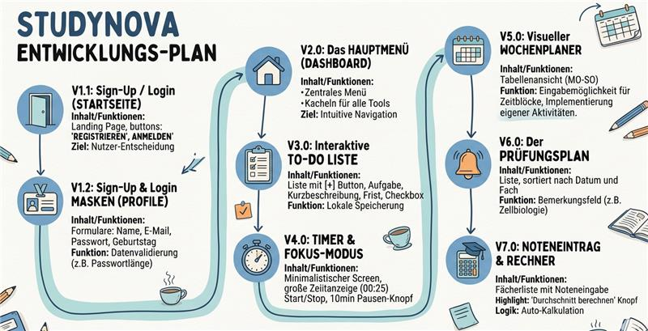

# Roadmap Studynova

## Version 1.1: Sign-Up / Login

- Inhalt: Ein schlichtes Design mit zwei großen Buttons: SIGN UP und LOG IN.

- Ziel: Der User entscheidet, ob er neu ist oder bereits ein Konto hat.

## Version 1.2: Sign-Up & Login Masken

- Inhalt: Formulare für Name, E-Mail, Passwort und Geburtstag.

- Funktion: Die App muss erkennen, ob die Daten korrekt ausgefüllt sind (z. B. "Passwort zu kurz").

## Version 2.0: Das Hauptmenü (Dashboard)

- Inhalt: Hauptmenü um zwischen den folgenden Elementen auszuwählen. Nach dem Login landet man hier.

- Elemente: Kacheln oder Buttons für:

1. To-Do Liste

2. Timer / Fokus-Modus

3. Wochenplaner

4. Prüfungsplan

5. Noteneintrag

- Ziel: Eine intuitive Navigation zu allen Unterseiten.

## Version 3.0: Die interaktive To-Do Liste

- Inhalt: Liste mit Add-Button (+).

- Features: Spalten für Aufgabe, kurze Beschreibung, Deadline und eine Checkbox zum Abhaken. Daten müssen lokal gespeichert werden, damit sie beim Neustart noch da sind.

## Version 4.0: Timer & Fokus-Modus

- Inhalt: Ein minimalistischer Screen mit einer großen Zeitanzeige (00:25).

- Features: Start- und Stop-Button. Integration einer "10min Pause"-Funktion.

## Version 5.0: Der visuelle Wochenplaner

- Inhalt: Die Tabellenansicht (MO–SO).

- Features: Eingabemöglichkeit für Zeitblöcke. Implementierung eures Farbcodes (L, A, C, F).

## Version 6.0: Der Prüfungsplan

- Inhalt: Eine Liste, sortiert nach Datum und Fach.

- Features: Spezielles Feld für "Bemerkungen" (z. B. "Thema: Zellbiologie"), damit man weiß, was genau gelernt werden muss.

## Version 7.0: Noteneintrag

- Inhalt: Fächerliste mit Eingabefeldern für Noten.

- Highlight: Der Button "Durchschnitt berechnen".

- Logik: Die App rechnet automatisch: (Note 1 + Note 2) / Anzahl Noten.